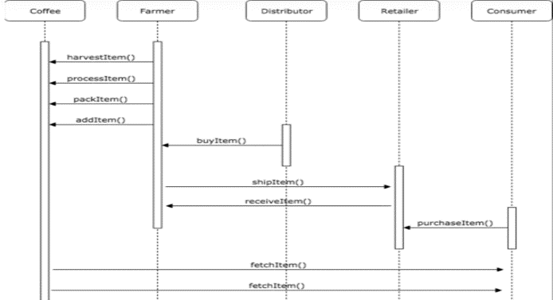

# Supply-Chain

This is a DApp for supply chain solution for Coffee farming backed by the Ethereum platform. Solution uses smart contracts that manage specific user permission controls as well as contracts that track and verify a product’s authenticity.

## Technologies

- Ethereum Blockchain
- Ganache Network
- Solidity
- Java Script, JQuery, NodeJS
- HTML, CSS
- Truffle, Remix

## How-To Run

- Make sure NodeJS is installed
- Use npm i -g truffle@4.1.14 to make sure appropriate truffle version is in place
- Use truffle deploy --reset to deploy the contracts on Ganache network
- Use npm run dev to start the lite-server for HTML based front-end

## Process Flow

Functionality of app can be explored by going through different stages as outlined below. 

